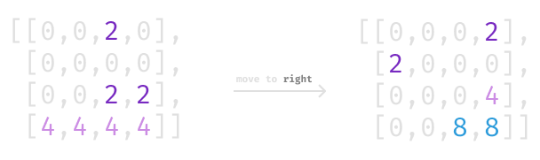

A library of functions based on functional programming paradigm to you create your 2048 game.

## What is it?

It takes a board state, execute a movement, spawn a new 2 or 4 tile and return a new board state.



## Why?

Well, it's fun. It's not?

## Introduction

A Board is a matrix with Tile object in their values.  
```ts
type Board = [
  [T, T, T, T],
  [T, T, T, T],
  [T, T, T, T],
  [T, T, T, T],
]
```

A Tile is an object with some data.
```ts
type T = {
  value: number, // 0, 2, 4, 8, 16...
  score: number, // score of tile, used to calculate total score
  key: string, // a hash to identify the tile, can be used to animations & others
}

// example
const tile = {
  value: 8,
  score: 16,
  key: 'kfao4fjt',
}
```

Sometimes to simplify I'll use the board values, that is the same matrix with a number values instead of tiles.
```js
type N = number
type BoardValues = [
  [N, N, N, N],
  [N, N, N, N],
  [N, N, N, N],
  [N, N, N, N],
]

// example
const boardValues = [
  [0, 2, 0, 2],
  [0, 0, 2, 4],
  [0, 0, 2, 4],
  [0, 2, 4, 8],
]
``` 

A direction is just a string that says to board to where it will be moved
```ts
type Direction = LEFT | RIGHT | UP | DOWN
``` 

## Docs

Subtitle:  
```js
N = Value // 0, 2, 4, 8, 16,...
D = Direction
T = Tile
[T] = Board // matrix with tiles
[N] = Board Values // matrix with values (numbers)
[*] = Matrix
```

All functions can me imported from 2048 lib:
```js
import { directions, newBoard, moveBoard, /*, ... */ } from '2048.js'
const { LEFT, RIGHT, UP, DOWN } = directions

```

## Docs API

### newTile
`newTile(): T`

Create a new tile.

```jsx
const tile = newTile()
const tile16 = newTile({ value: 16 }) // with some default value
```

### newBoard
`newBoard(size = 4): [T]`

Create a new board.

```js
const board = newBoard() // create 4x4 board
const board5 = newBoard(5) // create 5x5 board
``` 

### moveBoard
`moveBoard(D)([T]): [T]` 

Create a new board passing a direction and current board.

```js
const moved = moveBoard(RIGHT)(board)
``` 

### mapMatrix
`mapMatrix(fn)([*]): [*]`

Map a matrix.

```jsx
const doubled = mapMatrix(tile => tile.value * 2)(board)
``` 

### spawnTile
`spawnTile([T]): [T]`

Spawn a new tile in some empty position in a board.

```js
let state = newBoard()
state = moveBoard(RIGHT)(state)
state = spawnTile(state)
``` 

### canMoveBoard
`canMoveBoard(D)([T]): boolean`

Check if it's possible to make a move in a certain direction in a board.

```js
const canMoveToRight = canMoveBoard(RIGHT)(board)
```

### isGameOver
`isGameOver([T]): boolean`

Check if there are no more possible moves in a board.

```js
const gameOver = isGameOver(board)
```

### scoreBoard
`scoreBoard([T]): number`

Get the score of a board.

```js
const score = scoreBoard(board)
// score: 548
```

### values
`values([T]): [N]`

Takes a matrix with tiles and return a matrix with their values.

```js
// board[0][0] -> { value: 16, ... }
const boardValues = values(board)
// boardValues[0][0] -> 16
```

### flatValues
`flatValues([T]): [N]`

Takes a matrix with tiles and return a flat array with their values.

```js
const flattened = flatValues(board)
// flattened -> [0, 0, 0, 2, 0, 0, 0, 2, 0, 2, 2, 2, 0, 2, 2, 4]
```